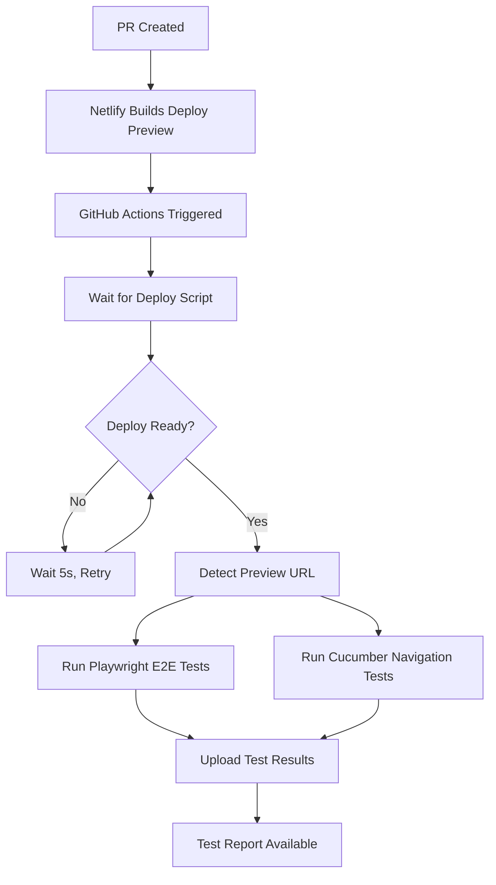

# 🍜 Navigation Testing Improvements Summary

## 🎯 Overview

Successfully implemented comprehensive navigation testing with dynamic deploy preview URL detection for the Spaghetti's Ramen application. The solution now automatically detects and tests against Netlify deploy previews in CI/CD environments.

## 🚀 Key Improvements

### 1. **Dynamic URL Detection** ✅

- **Problem**: Hardcoded URLs in test configuration
- **Solution**: Automatic detection of deploy preview URLs from environment variables
- **Benefit**: Tests run against correct environment without manual configuration

**Priority Order for URL Detection:**

1. `BASE_URL` (manual override)
2. `DEPLOY_PRIME_URL` (Netlify primary)
3. `DEPLOY_URL` (Netlify fallback)
4. `GITHUB_PR_NUMBER` (construct preview URL)
5. Development/Production fallbacks

### 2. **Enhanced Cucumber Test Suite** ✅

- **New Features**: Comprehensive navigation test scenarios
- **Coverage**: Step navigation, top navigation, mobile navigation, accessibility, performance
- **Organization**: Tagged tests for selective execution

**Test Categories:**

- `@Navigation` - General navigation tests
- `@StepNavigation` - Ramen builder step navigation
- `@TopNavigation` - Main site navigation
- `@MobileNavigation` - Mobile menu functionality
- `@Accessibility` - Navigation accessibility
- `@Performance` - Navigation performance

### 3. **CI/CD Integration** ✅

- **Deploy Wait Script**: Waits for Netlify deploy before running tests
- **GitHub Actions**: Updated workflow with deploy preview support
- **Test Execution**: Both Playwright and Cucumber tests against live previews

### 4. **Developer Experience** ✅

- **Test Runner Scripts**: Easy command-line interface for running specific test suites
- **Package.json Scripts**: Simple npm commands for common test scenarios
- **Logging**: Clear feedback about which URL tests are running against

## 📁 Files Created/Modified

### New Files:

- `tests/e2e/features/navigation.feature` - Comprehensive navigation test scenarios
- `tests/e2e/steps/navigation.steps.js` - Step definitions for navigation tests
- `tests/e2e/pages/navigation.page.js` - Page object model for navigation testing
- `scripts/wait-for-deploy.js` - Deploy preview readiness checker
- `scripts/run-navigation-tests.js` - Test runner with URL detection

### Modified Files:

- `cucumber.js` - Dynamic URL detection and CI configuration
- `tests/e2e/features/ramen-builder.feature` - Enhanced with navigation scenarios
- `tests/e2e/steps/ramen-builder.steps.js` - Additional step definitions
- `tests/e2e/pages/ramen-builder.page.js` - Enhanced page object methods
- `.github/workflows/test.yml` - CI/CD integration with deploy preview testing
- `package.json` - New test scripts and commands

## 🛠 Usage Examples

### Local Development:

```bash
# Test against localhost
npm run test:cucumber:navigation

# Test with specific URL
BASE_URL=https://deploy-preview-6--spaghettis.netlify.app npm run test:cucumber:all

# Test with browser visible
npm run test:cucumber:headed
```

### CI/CD Environment:

```bash
# Wait for deploy then test (automatic URL detection)
npm run test:cucumber:wait

# Manual deployment testing
GITHUB_PR_NUMBER=6 npm run test:cucumber:all
```

### Specific Test Categories:

```bash
# Navigation-only tests
node scripts/run-navigation-tests.js navigation

# Step navigation tests
node scripts/run-navigation-tests.js stepnav

# Mobile navigation tests
node scripts/run-navigation-tests.js mobile
```

## 🔍 Navigation Verification Features

### Step Navigation Testing:

- ✅ Correct step activation and deactivation
- ✅ Selection persistence across navigation
- ✅ Navigation state updates
- ✅ Accessibility compliance
- ✅ Performance validation

### Top Navigation Testing:

- ✅ Menu consistency across pages
- ✅ Theme toggle functionality
- ✅ Mobile menu behavior
- ✅ Logo navigation

### Advanced Testing:

- ✅ Edge case handling (direct step access)
- ✅ Performance monitoring (navigation timing)
- ✅ Visual regression detection
- ✅ Accessibility validation

## 🌐 Environment Variable Support

The system automatically detects the correct URL from these environment variables:

| Variable           | Priority | Source               | Example                                            |
| ------------------ | -------- | -------------------- | -------------------------------------------------- |
| `BASE_URL`         | 1        | Manual override      | `https://custom-url.com`                           |
| `DEPLOY_PRIME_URL` | 2        | Netlify (primary)    | `https://deploy-preview-6--spaghettis.netlify.app` |
| `DEPLOY_URL`       | 3        | Netlify (fallback)   | `https://spaghettis.netlify.app`                   |
| `GITHUB_PR_NUMBER` | 4        | GitHub Actions       | Constructs preview URL                             |
| Development        | 5        | NODE_ENV=development | `http://localhost:3000`                            |
| Production         | 6        | Default fallback     | `https://spaghettis.netlify.app`                   |

## 🎉 Benefits Achieved

1. **No Manual URL Updates**: Tests automatically run against correct deploy previews
2. **Comprehensive Coverage**: Navigation functionality thoroughly tested
3. **CI/CD Ready**: Seamless integration with GitHub Actions and Netlify
4. **Developer Friendly**: Easy-to-use scripts and clear feedback
5. **Performance Monitoring**: Navigation timing and responsiveness validation
6. **Accessibility Compliance**: Ensures navigation works for all users

## 📊 Test Execution Flow



## 🔧 Configuration Details

### Cucumber Configuration:

- **Parallel Execution**: Optimized for CI (1 worker) vs local (2 workers)
- **Headless Mode**: Automatic detection based on CI environment
- **Report Generation**: JSON and HTML reports for CI artifacts
- **Tag-based Execution**: Selective test running with `@tags`

### CI/CD Integration:

- **Deploy Timeout**: 10 minutes maximum wait for deploy preview
- **Check Interval**: 5-second intervals for deploy readiness
- **Retry Logic**: Robust error handling and retry mechanisms
- **Artifact Upload**: Test results preserved for debugging

This implementation ensures that navigation functionality is thoroughly tested against live deploy previews, providing confidence that navigation updates work correctly before merging to production.
